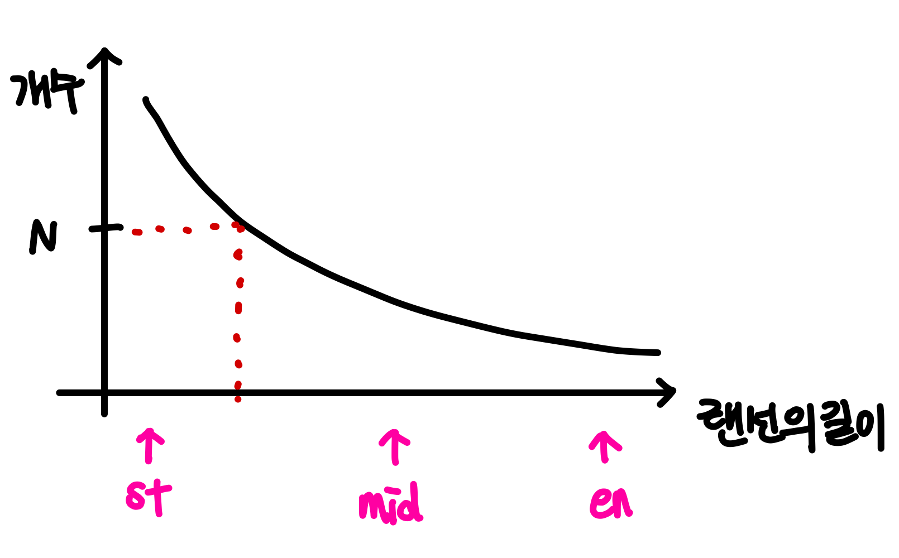

# 1654 랜선 자르기

### Parametric Search(매개변수 탐색) 문제
조건을 만족하는 **최소/최대값**을 구하는 **문제(최적화 문제)를 결정 문제로 변환**해 이분탐색을 수행하는 방법

(최적화 문제) N개를 만들 수 있는 랜선의 **_최대_** 길이

(결정 문제) 랜선의 길이가 X일 때 랜선이 N개 **_이상인가 아닌가?_**

